# Laporan Soal Praktikum Modul 1

1. Bryan pratma Putra (1202190037)
2. Deny Satria Ardi (1202190026)

------

<!--
### Objectives

### Daftar Isi
[1. Rename Ubuntu_php5.6 Menjadi Ubuntu_landing](https://github.com/bryanpratama/Sistem-Administrasi-Server/Modul%201#1-rename-ubuntu_php56-menjadi-ubuntu_landing)<br>
[2. Install LXC debian 9 dengan nama debian_php5.6](https://github.com/bryanpratama/Sistem-Administrasi-Server/Modul%201#2-install-lxc-debian-9-dengan-nama-debian_php56)<br>
[3. Setup nginx pada dabian_php5.6](https://github.com/bryanpratama/Sistem-Administrasi-Server/new/main/Modul%201#3-setup-nginx-pada-dabian_php56)<br>
[4. Setup nginx pada ubuntu_landing](https://github.com/bryanpratama/Sistem-Administrasi-Server/new/main/Modul%201#4-setup-nginx-pada-ubuntu_landing)<br>
[5. Auto start pada LXC ubuntu_landing](https://github.com/bryanpratama/Sistem-Administrasi-Server/new/main/Modul%201#5-auto-start-pada-lxc-ubuntu_landing)<br>
[6. Setup nginx pada vm.local mengatur proxy_pass](https://github.com/bryanpratama/Sistem-Administrasi-Server/new/main/Modul%201#6-setup-nginx-pada-vmlocal-mengatur-proxy_pass)<br>
[7. Tampilan pada browser](https://github.com/bryanpratama/Sistem-Administrasi-Server/Modul%201#7-tampilan-pada-browser)<br>
[8. Analisa](https://github.com/bryanpratama/Sistem-Administrasi-Server/Modul%201#8-analisa)<br>
-->

### Skema
Virtual Box Ubuntu Server IP : 192.168.0.10

LXC ubuntu server 18.04 php 7.4 : 10.0.3.101

LXC debian server 9 php 5.6 : 10.0.3.102

LXC ubuntu server 16.04 : 10.0.3.101

------

#### 1. Rename Ubuntu_php5.6 menjadi Ubuntu_landing

Jalankan
```
sudo lxc-copy -R -n ubuntu_php5.6 -N ubuntu_landing
```
Command ini digunakan untuk merubah nama dari ubuntu_php5.6 ke ubuntu_landing

Kemudian mengecek nama sudah berubah
```
sudo lxc-ls -f
```

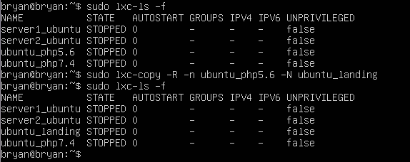

Start container dari ubuntu_landing
```
sudo lxc-start -n ubuntu_landing
```
Masuk ke container
```
sudo lxc-attach -n ubuntu_landing
```
Kemudian merubah IP sesuai skema ip address menjadi 10.0.3.103
```
nano /etc/network/interfaces
```

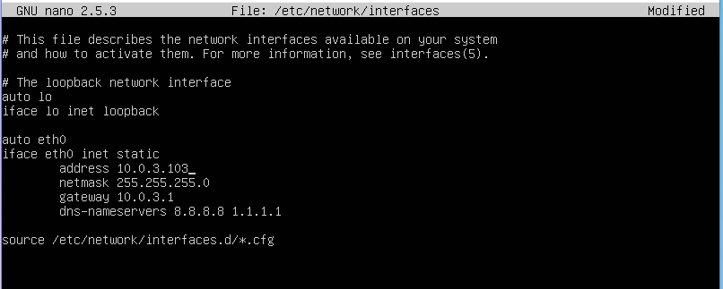

Jika mengalami double ip bisa melakukan reboot
```
reboot
```
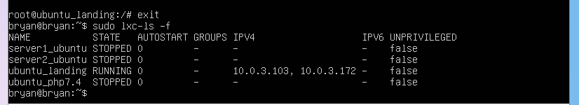

Jika sudah bisa keluar dengan command atau crtl + D
```
exit
```

Merubah ip ubuntu_php7.4
Start container dari ubuntu_php7.4
```
sudo lxc-start -n ubuntu_php7.4
```
Masuk ke container
```
sudo lxc-attach -n ubuntu_php7.4
```
Kemudian merubah IP sesuai skema ip address menjadi 10.0.3.101
```
nano /etc/netplan/10-lxc.yaml
```


Jika sudah silakan apply dengan menggunakan command
```
sudo netplan apply
```
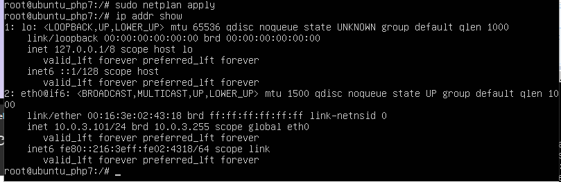

#### 2. Install LXC debian 9 dengan nama debian_php5.6

Jalankan
```
sudo lxc-create -n ubuntu_php5.6 -t download -- --dist debian --release stretch --arch amd64 --force-cache --no-validate --server images.linuxcontainers.org
```
Command ini digunakan untuk menginstall LXC dengan nama debian_5.6

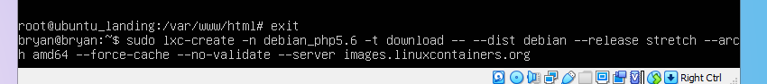

Kemudian cek apakah debian_php5.6 sudah ter-install, dengan command
```
sudo lxc-ls -f
```
Sehingga akan terlihat tampilan seperti gambar dibawah ini, yang artinya sudah berhasil ter-install 
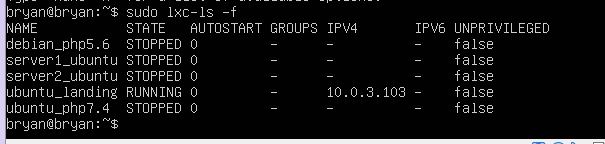

#### 3. Setup nginx pada dabian_php5.6
Start container dari debian_php5.6
```
sudo lxc-start -n debian_php5.6
```
Masuk ke container
```
sudo lxc-attach -n debian_php5.6
```
Kemudian install nginx dan nginx extras
```
sudo apt install nginx nginx-extras
```
start debian_php5.6 dan install nginx

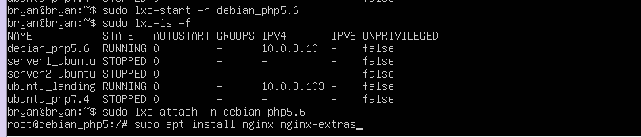

Kemudian install nano, net-tools, dan curl
```
apt install nano net-tools curl
```
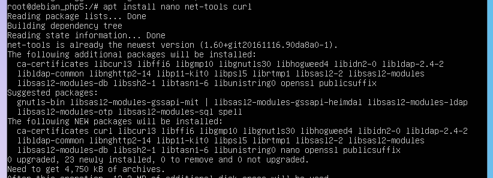

Kemudian merubah IP sesuai skema ip address menjadi 10.0.3.102
```
nano /etc/network/interfaces
```

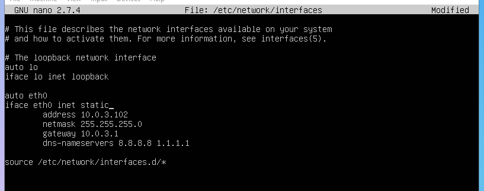

Untuk melihat perubahan silahkan melakukan restart
```
restart
```
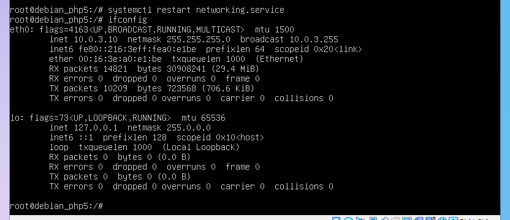

jika ip tetap tidak berubah silakam melakukan reboot
```
reboot
```


setting nginx
```
cd /etc/nginx/sites-available
```
Membuat file baru dengan nama lxc_php5.6.dev
```
touch lxc_php5.6.dev
```
```
nano lxc_php5.6.dev
```
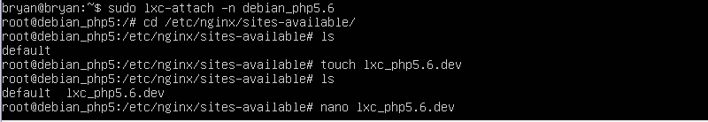

Masuk ke lxc_php5.6.dev dan lakukan konfigurasi seperti dibawah

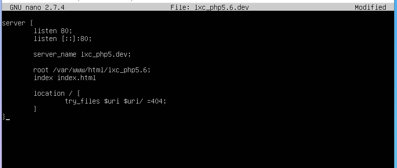

Kemudian masuk ke sites-enabled
```
cd ../sites-enabled
ln -s /etc/nginx/sites-available/lxc_landing.dev .
```
Gunakan ```nginx -t``` untuk melakukan koreksi dan ```nginx -s reload ```untuk melakukan reload
```
nginx -t
nginx -s reload
```
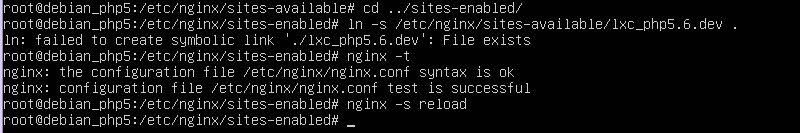

Lalu masuk ke hosts untuk menambahkan ```lxc_php5.6.dev```
```
nano /etc/hosts
```
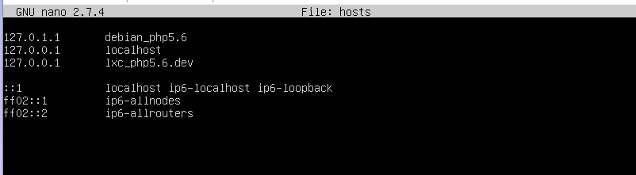

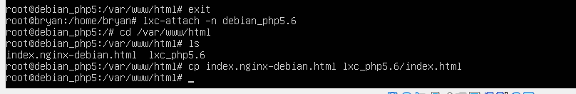

Masuk ke direktori html
```
cd /var/www/html
cp index.nginx-debian.html lxc_php5.6/index.html
nano lxc_php5.6/index.html
```
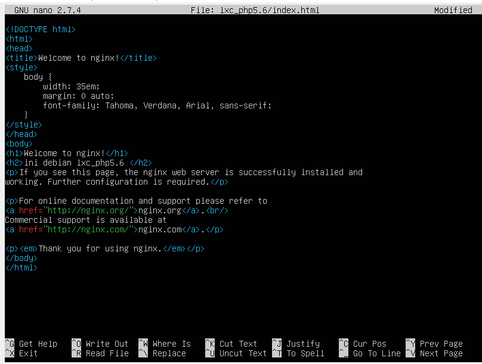

#### 4. Setup nginx pada ubuntu_landing
Masuk ke ubuntu landing, kemudian masuk ke file lxc landing.dev, dengan command
```
nano lxc_landing.dev
```
setelah itu ketik seperti yang tertera pada gambar

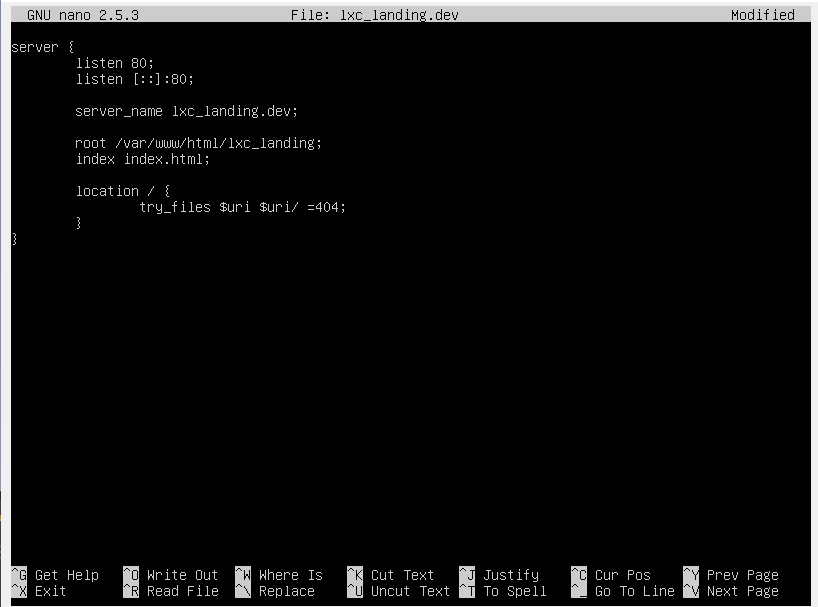

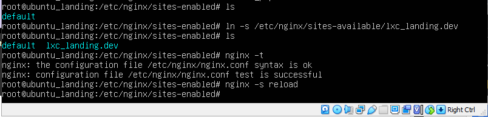

Setelah itu tambahkan LXC landing pada hosts
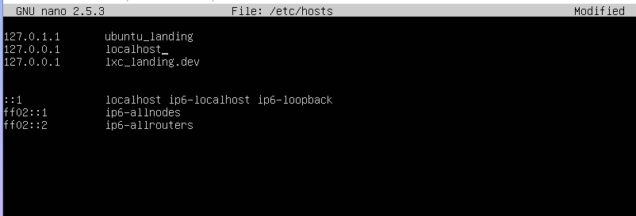

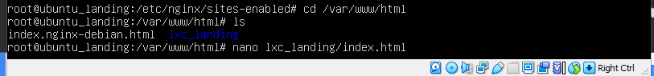

Kemudian masuk ke halaman index.html untuk memasukkan pesan seperti pada gambar dibawah
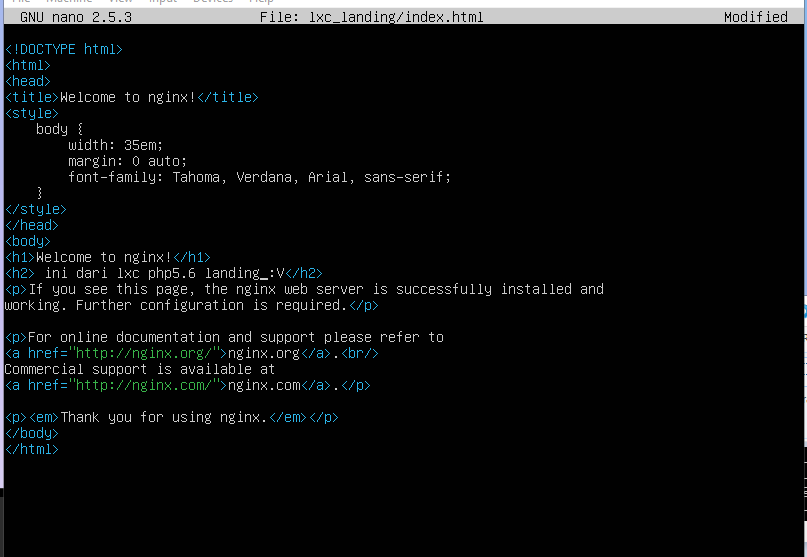

#### 5. Auto start pada LXC ubuntu_landing

Sebelum melakukan auto start, hentikan terlebih dahulu ubuntu landing
```
sudo lxc-stop -n ubuntu_landing
```


Masuk ke ubuntu landing 
```
sudo su
cd /var/lib/lxc
cd ubuntu_landing
```
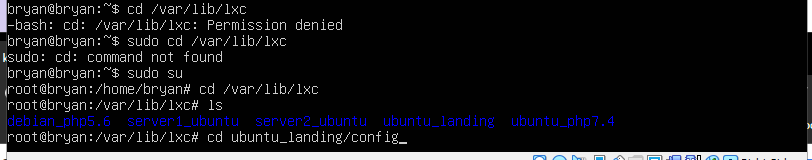

Kemudian masuk ke config
```
nano config
```
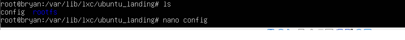

menambahkan config  ```lxc.start.auto = 1```
```
lxc.start.auto = 1
```
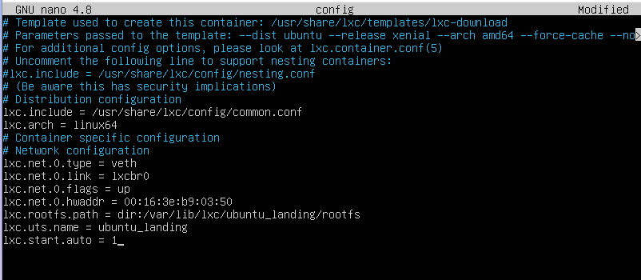

Jika sudah silahkan lakukan ```reboot```
```
lxc-ls -f
```
maka ubuntu landing akan otomatis menyala dan autostart = 1
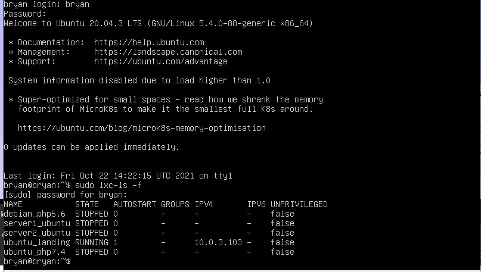

#### 6. Setup nginx pada vm.local mengatur proxy_pass

masuk ke hosts vm.local dengan comand 
```
sudo nano /etc/hosts
```
sehinngga akan muncul seperti gambar dibawah

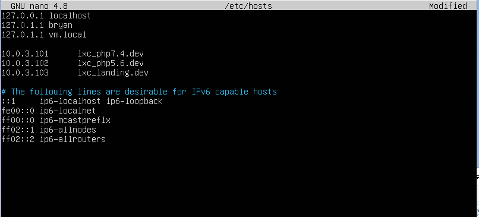

Setelah itu, masuk ke direktori sites-available, lalu masuk ke vm.local

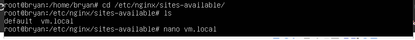

sehingga akan masuk ke file vm.local, lalu ketik seperti yang tertera pada gambar

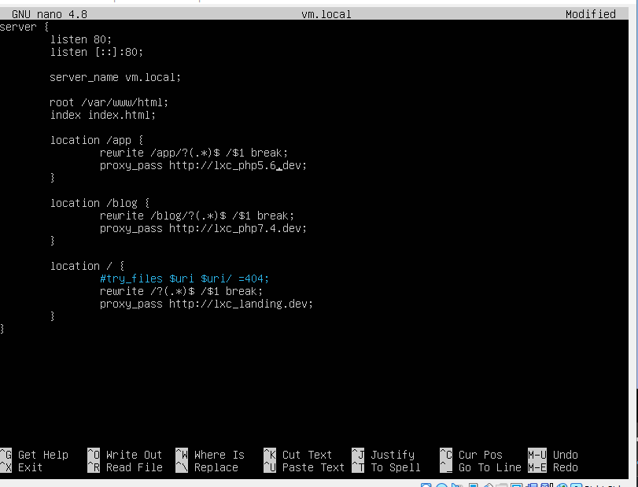

#### 7. Tampilan pada browser
Test curl melalui kontainer masing-masing

LXC ubuntu server 18.04 ```ubuntu_php7.4```
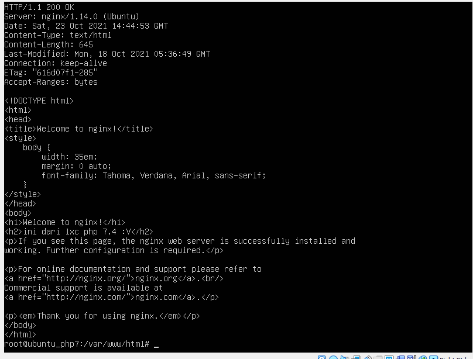

LXC debian server 9 ```debian_php5.6 ```
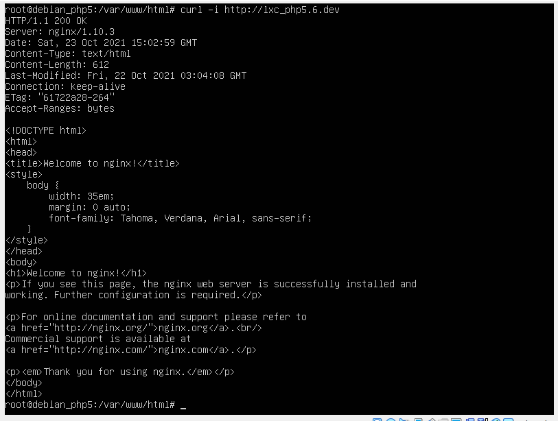

LXC ubuntu server 16.04 ```ubuntu_landing```
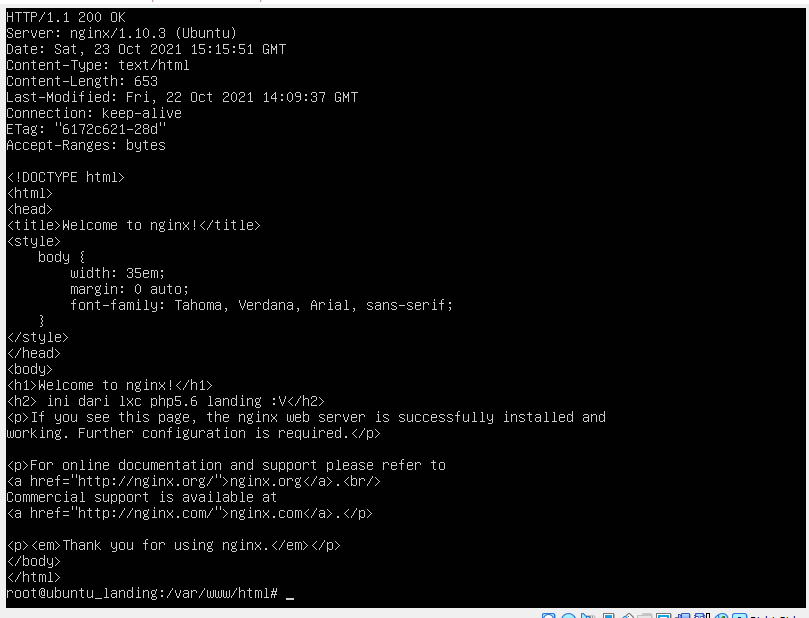

Melakukan curl di home

LXC ubuntu server 18.04 ```ubuntu_php7.4```
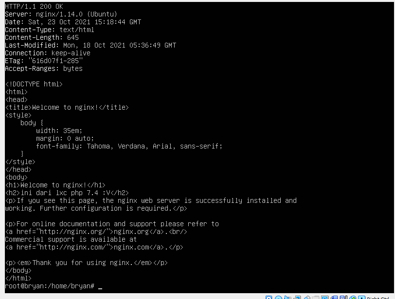

LXC debian server 9 ```debian_php5.6 ```
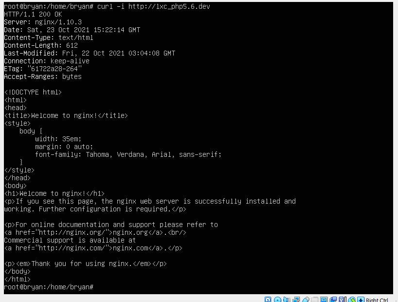

LXC ubuntu server 16.04 ```ubuntu_landing```
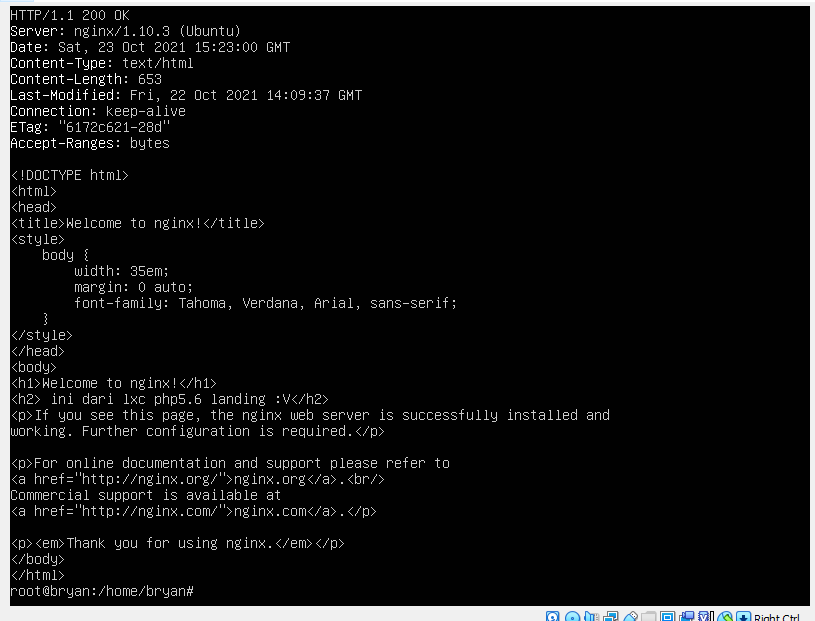

Cek lewat browser

```
vm.local/blog
```
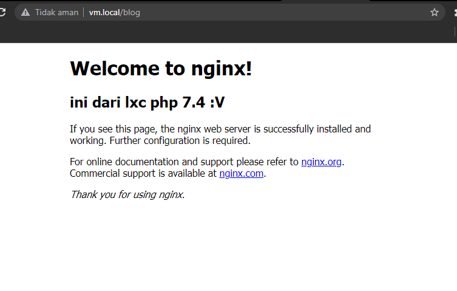


```
vm.local/app
```
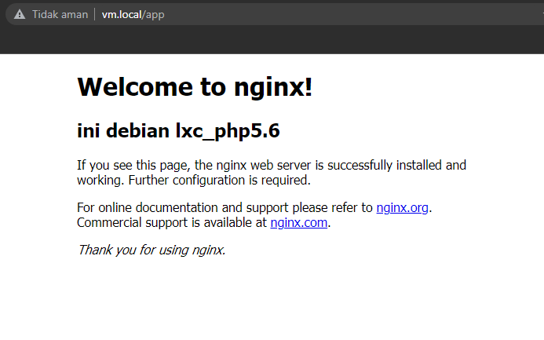


```
vm.local/
```
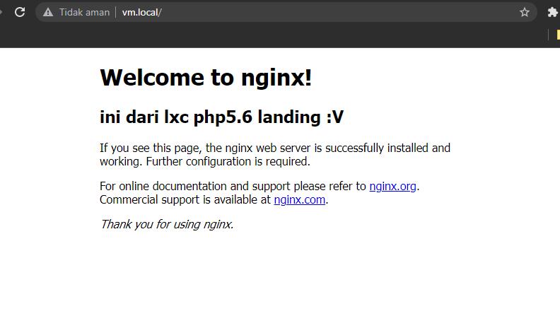

#### 8. Analisis Praktikum
   - Mengapa untuk kebutuhan php5.6 tidak bisa menggunakan ubuntu 16.04, sehingga perlu diganti os ke debian 9?
     
     Hal itu karena tidak adanya lagi dukungan oleh support system atau pembaruan perangkat lunak seperti keamanan,repositori, dll dari ubuntu 16.04 untuk php5.6 di pembaharuan terakhir pada april 2021 sehingga perlu berganti menggukankan debian 9 yang  mana akan disupport sampai tahun 2022.<br>
   - Kenapa harus menggunakan virtualisasi LXC pada skema website yang akan didevelop?

     Hal itu karena peggunaan virtualisai LXC(Linux Containers) yang ringan dan efisien dalam penggunaanya sehingga dianggap mudah dalam pengelolaan server, serta memiliki banyak sistem operasi/perintah seperti create, start, dan destroy.<br>
   - Apa yang dimaksud dengan proxy server? kenapa vm.local bisa kita anggap sebagai proxy server?

     proxy server merupakan sebuah sistem yang berfungsi menjadi penghubunng antara komputer untuk mengakses jaringan. Sehingga vm.local dapat dianggap sebagai proxy server karena dalam proses ini vm.local dikonfigurasi agar server yang dibuat dalam virtualisasi os dapat mengakses langsung website yang telah dibuat melalui browser komputer lokal.<br>
