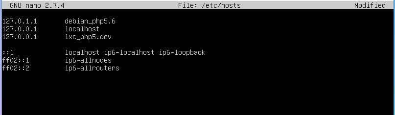
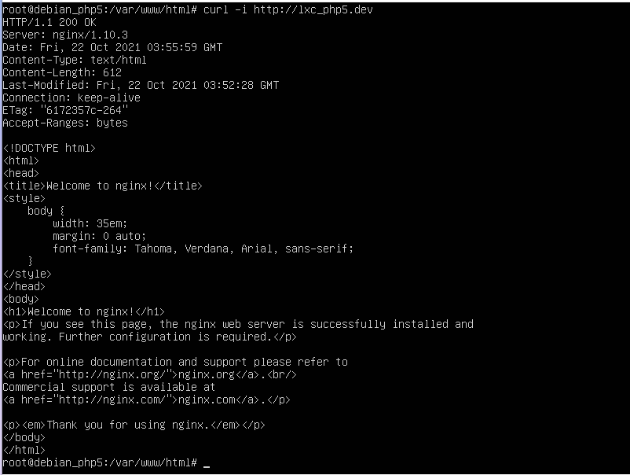
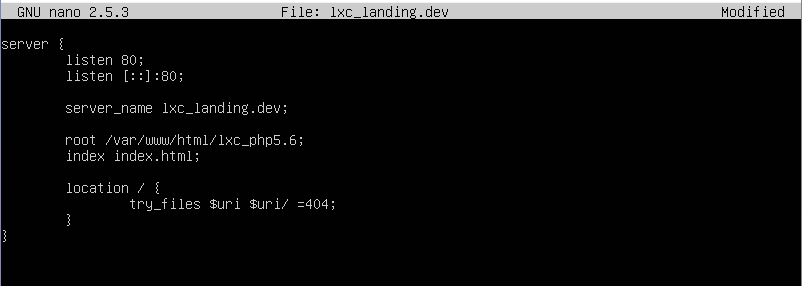
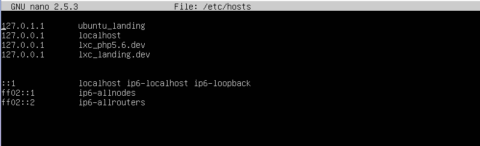
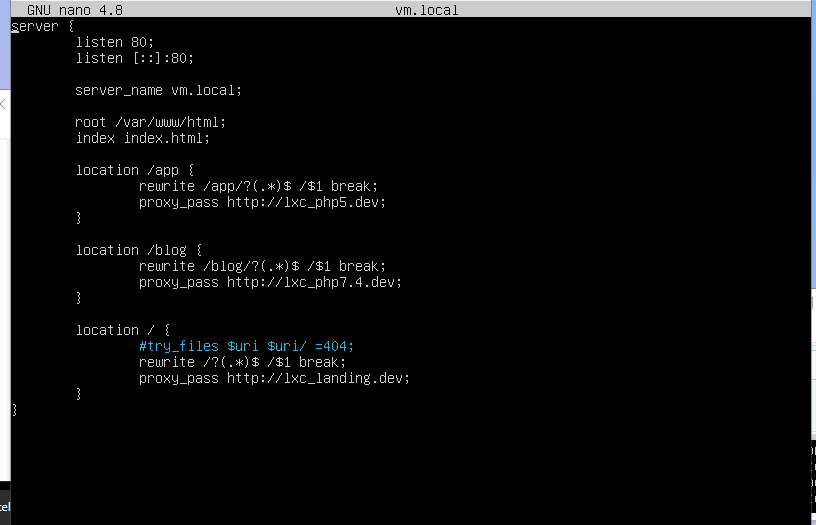

# Laporan Soal Praktikum Modul 1

1. Bryan pratma Putra (1202190037)
2. Deny Satria Ardi (1202190026)

### Objectives

### Daftar Isi
[1. Rename Ubuntu_php5.6 Menjadi Ubuntu_landing](https://github.com/bryanpratama/Sistem-Administrasi-Server/new/main/Modul%201#1-rename-ubuntu_php56-menjadi-ubuntu_landing) 
[2. Install LXC debian 9 dengan nama debian_php5.6](https://github.com/bryanpratama/Sistem-Administrasi-Server/new/main/Modul%201#2-install-lxc-debian-9-dengan-nama-debian_php56) 
[3. Setup nginx pada dabian_php5.6](https://github.com/bryanpratama/Sistem-Administrasi-Server/new/main/Modul%201#3-setup-nginx-pada-dabian_php56) 
[4. Setup nginx pada ubuntu_landing](https://github.com/bryanpratama/Sistem-Administrasi-Server/new/main/Modul%201#4-setup-nginx-pada-ubuntu_landing) 
[5. Auto start pada LXC ubuntu_landing](https://github.com/bryanpratama/Sistem-Administrasi-Server/new/main/Modul%201#5-auto-start-pada-lxc-ubuntu_landing) 
[6. Setup nginx pada vm.local mengatur proxy_pass](https://github.com/bryanpratama/Sistem-Administrasi-Server/new/main/Modul%201#6-setup-nginx-pada-vmlocal-mengatur-proxy_pass) 
[7. Tampilan pada browser](https://github.com/bryanpratama/Sistem-Administrasi-Server/new/main/Modul%201#7-tampilan-pada-browser) 
[8. Analisa](https://github.com/bryanpratama/Sistem-Administrasi-Server/new/main/Modul%201#8-analisa) 

#### 1. Rename Ubuntu_php5.6 menjadi Ubuntu_landing
ubah nama

ubah ip ke 103

jika mengalami double ip bisa melakukan reboot

ubah ip ubuntu_php7.4 ke 101

sudo netplan apply

#### 2. Install LXC debian 9 dengan nama debian_php5.6

membuat debian_php5.6

mengecek debian_php5.6

#### 3. Setup nginx pada dabian_php5.6

start debian_php5.6 dan install nginx

install nano, net-tools, dan curl

setting ip jadi 102

melakukan restart 

jika ip tidak berubah silakam melakukan reboot

setting nginx

mengiisi lxc_php5.6

butuh pembaruan

#### 4. Setup nginx pada ubuntu_landing

butuh pembaruan ke index lxc_landing

melakukan test dengan curl ke lxc_landing.dev

#### 5. Auto start pada LXC ubuntu_landing

sebelum melakukan auto start stop terlebih dahulu ubuntu landing

masuk ke ubuntu landing config

menambahkan config dengan lxc.start.auto = 1

maka auto start = 1

#### 6. Setup nginx pada vm.local mengatur proxy_pass

masuk ke hosts vm.local

masuk ke vm.local

butuh perbaikan

#### 7. Tampilan pada browser

curl didalam

curl dari home

dari browser

#### 8. Analisa
   - Mengapa untuk kebutuhan php5.6 tidak bisa menggunakan ubuntu 16.04, sehingga perlu diganti os ke debian 9?
   - Kenapa harus menggunakan virtualisasi LXC pada skema website yang akan didevelop?
   - Apa yang dimaksud dengan proxy server? kenapa vm.local bisa kita anggap sebagai proxy server?
