# Laporan Praktikum Modul 3

1. Bryan pratma Putra (1202190037)
2. Deny Satria Ardi (1202190026)

------
- Buat subdomain dev.vm.local menggunakan ansible dengan cara:
 
- Daftarkan subdomain vm.local ke DNS.

Masuk ke file ansible laravel, lalu buat file sublaravel

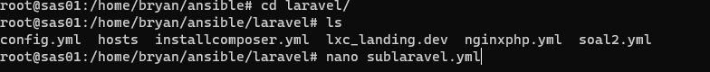

isi dile sublaravel, seperti berikut 
```
---
- hosts: all
  become : yes
  tasks:
    - name: install bind9 dan dnsutils
      apt:
       pkg:
         - bind9
         - dnsutil
```
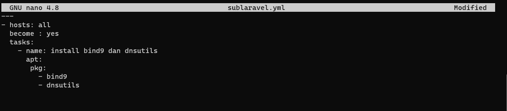

Install packages dengan  ``ansible-playbook -i host sublaravel.yml -k``

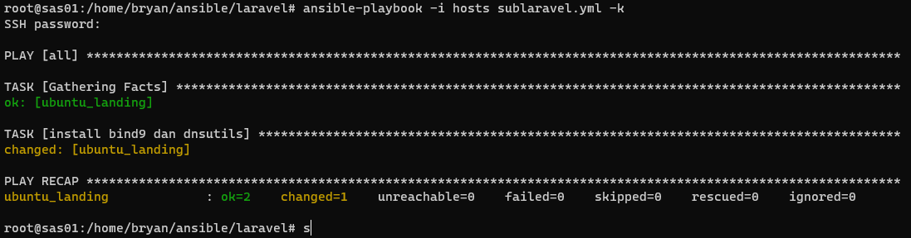

Buat file confi.yml, sebagai berikut

```
---
- hosts: all
  become : yes
  tasks:
   - name: membuat direktori
     file:
      path: /var/www/html/dev/landing
      state: directory
   - name: copy file vm.local
     copy:
      src: /etc/bind/vm/vm.local
      dest: /var/www/html/dev/landing
   - name: mengganti konfigurasi
     replace:
      path: /var/www/html/dev/landing/vm.local
      regexp: 'www'
      replace: 'dev'
   - name: copy file named.conf.local
     copy:
      src: /etc/bind/named.conf.local
      dest: /etc/bind/named.conf.local
   - name: mengganti konfigurasi conf local
     replace:
      path: /etc/bind/named.conf.local
      regexp: '/etc/bind/vm/vm.local'
      replace: '/var/www/html/dev/landing/vm.local'
   - name: mengganti konfigurasi conf local part2
     replace:
      path: /etc/bind/named.conf.local
      regexp: '/etc/bind/vm/db.192'
      replace: '/var/www/html/dev/landing/db.192'
   - name: copy file db.192
     copy:
      src: /etc/bind/vm/db.192
      dest: /var/www/html/dev/landing
   - name: copy file resolv.conf
     copy:
      src: /etc/resolv.conf
      dest: /etc/resolv.conf
   - name: copy file named.conf.options
     copy:
      src: /etc/bind/named.conf.options
      dest: /etc/bind/named.conf.options
   - name: restart nginx
     service:
      name: nginx
      state: restarted
   - name: restart bind9
     action: service name=bind9 state=restarted

```
     
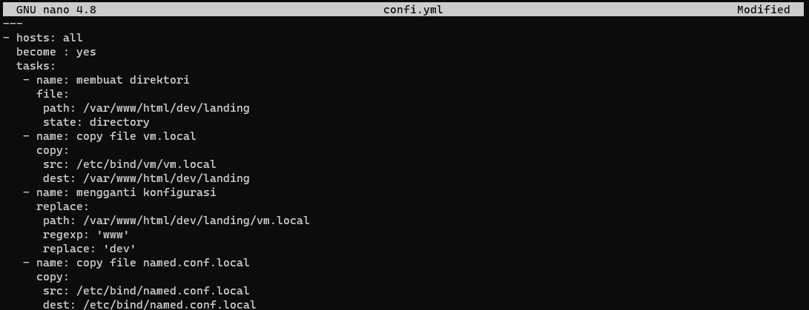

Kemudian install dengan perintah ``ansible-playbook -i host confi.yml -k``

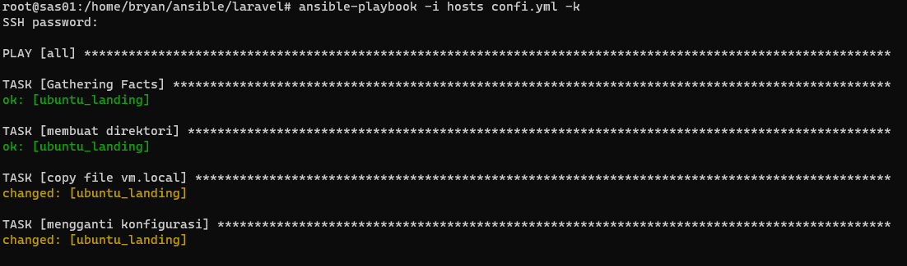

Tambahkan subdomain di /etc/hosts

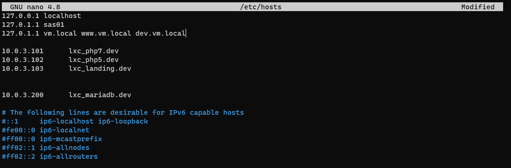

Masuk ke ssh root ubuntu landing, kemudian tambahkan ``www`` di vm.local ubuntu_landing

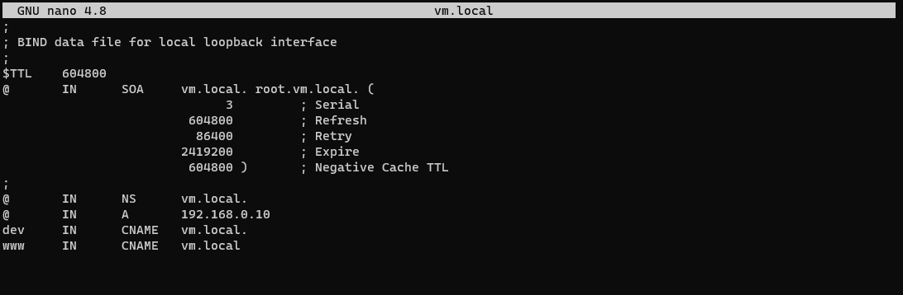

buka dan edit vm.local di `` nano/etc/nginx/sites-enabled/vm.local`` menjadi seperti pada gambar

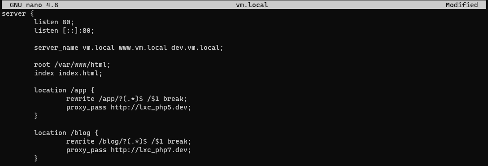

Buka and edit `` nano/etc/bind/vm/vm.local`` menjadi seperti pada gambar

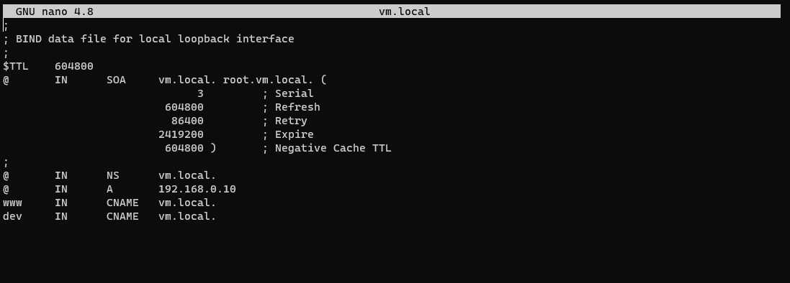

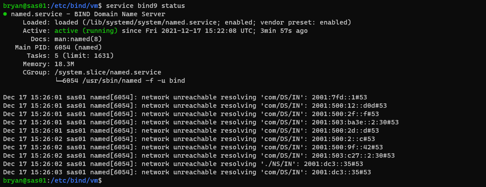

Restart

```
service bind9 restart
service nginx restart
/etc/init.d/named restart
```
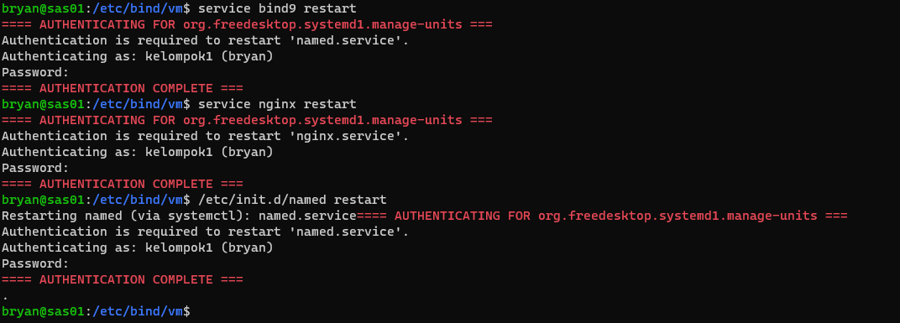

Buka pengaturan wi-fi. masuk ke menu IPv4, kemudian ubah dns pc menjadi ip vm

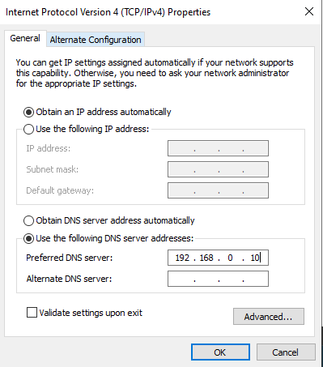

Setelah itu sambungkan lagi dengan wi-fi dan akses dev.vm.local

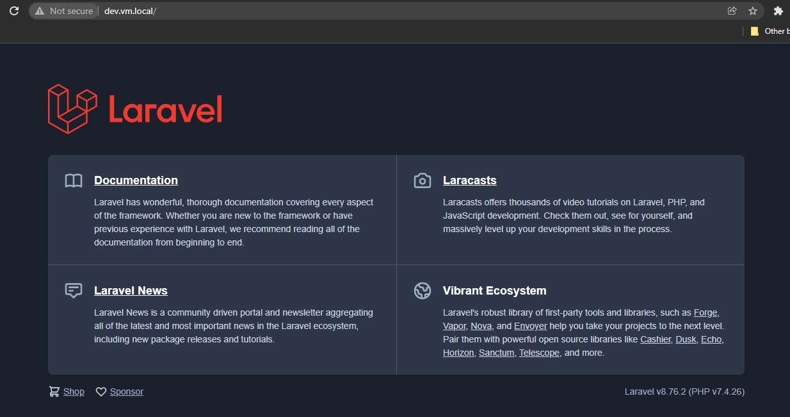

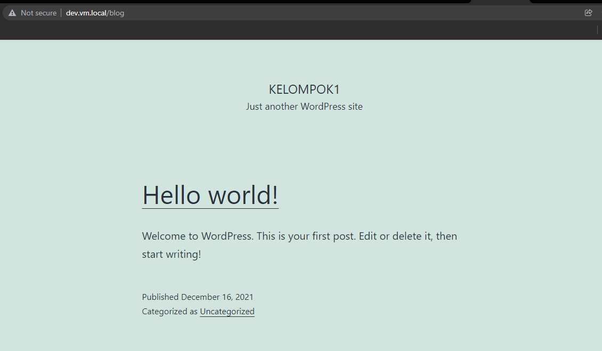

     
